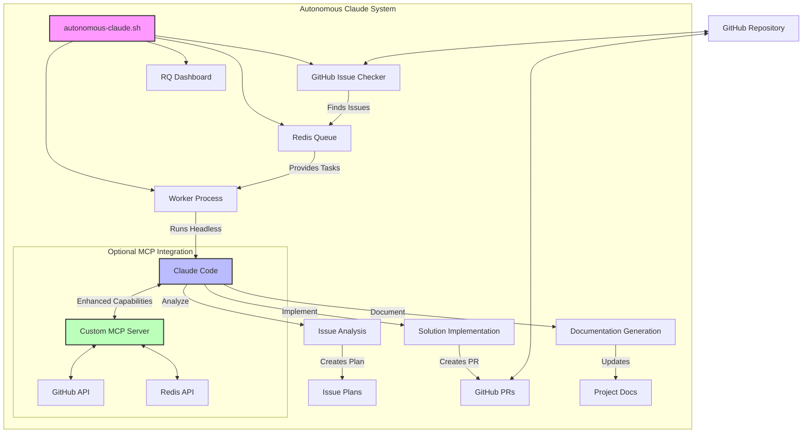

```mermaid
graph TB
    subgraph "Autonomous Claude System"
        A[autonomous-claude.sh] --> B[GitHub Issue Checker]
        A --> C[Redis Queue]
        A --> D[Worker Process]
        A --> E[RQ Dashboard]
        
        B -->|Finds Issues| C
        C -->|Provides Tasks| D
        D -->|Runs Headless| F[Claude Code]
        
        F -->|Analyze| G[Issue Analysis]
        F -->|Implement| H[Solution Implementation]
        F -->|Document| I[Documentation Generation]
        
        G -->|Creates Plan| J[Issue Plans]
        H -->|Creates PR| K[GitHub PRs]
        I -->|Updates| L[Project Docs]
        
        subgraph "Optional MCP Integration"
            M[Custom MCP Server]
            F <-->|Enhanced Capabilities| M
            M <--> N[GitHub API]
            M <--> O[Redis API]
        end
    end
    
    P[GitHub Repository] <--> B
    P <--> K
    
    style A fill:#f9f,stroke:#333,stroke-width:2px
    style F fill:#bbf,stroke:#333,stroke-width:2px
    style M fill:#bfb,stroke:#333,stroke-width:2px
```

To view this diagram, you need a Markdown viewer that supports Mermaid diagrams, or you can paste the Mermaid code into the [Mermaid Live Editor](https://mermaid.live/).